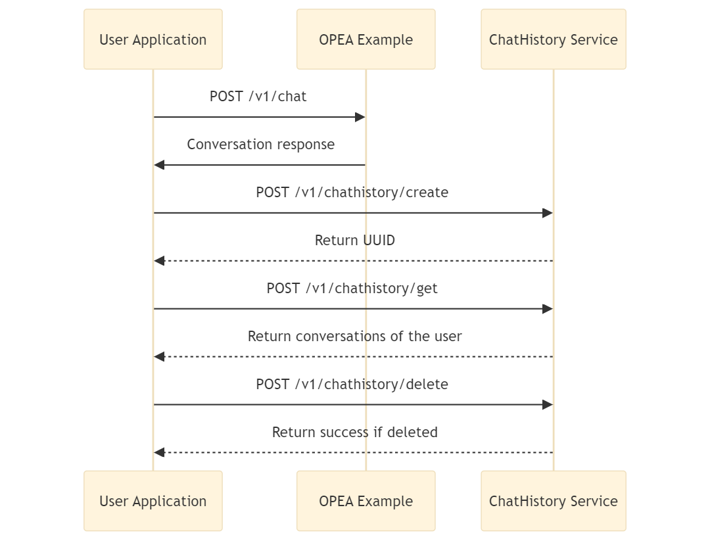

# Chat History Microservice

The Chat History Microservice allows you to store, retrieve and manage chat conversations with a MongoDB database. This microservice can be used for data persistence in OPEA chat applications, enabling you to save and access chat histories.



## Service Usage Guide

### Create or Update Conversation

Create a new conversation or update an existing one by specifying an ID:

```bash
# Create new conversation
curl -X 'POST' \
  http://localhost:6012/v1/chathistory/create \
  -H 'accept: application/json' \
  -H 'Content-Type: application/json' \
  -d '{
  "data": {
    "messages": "test Messages", 
    "user": "test"
  }
}'

# Update existing conversation
curl -X 'POST' \
  http://localhost:6012/v1/chathistory/create \
  -H 'accept: application/json' \
  -H 'Content-Type: application/json' \
  -d '{
  "data": {
    "messages": "test Messages Update", 
    "user": "test"
  },
  "id":"668620173180b591e1e0cd74"
}'
```

### Retrieve Conversations

Get all conversations for a user or a specific conversation by ID:

```bash
# Get all conversations
curl -X 'POST' \
  http://localhost:6012/v1/chathistory/get \
  -H 'accept: application/json' \
  -H 'Content-Type: application/json' \
  -d '{
  "user": "test"}'

# Get specific conversation
curl -X 'POST' \
  http://localhost:6012/v1/chathistory/get \
  -H 'accept: application/json' \
  -H 'Content-Type: application/json' \
  -d '{
  "user": "test", 
  "id":"668620173180b591e1e0cd74"}'
```

### Delete Conversation

Delete a specific conversation by ID:

```bash
curl -X 'POST' \
  http://localhost:6012/v1/chathistory/delete \
  -H 'accept: application/json' \
  -H 'Content-Type: application/json' \
  -d '{
  "user": "test", 
  "id":"668620173180b591e1e0cd74"}'
```
